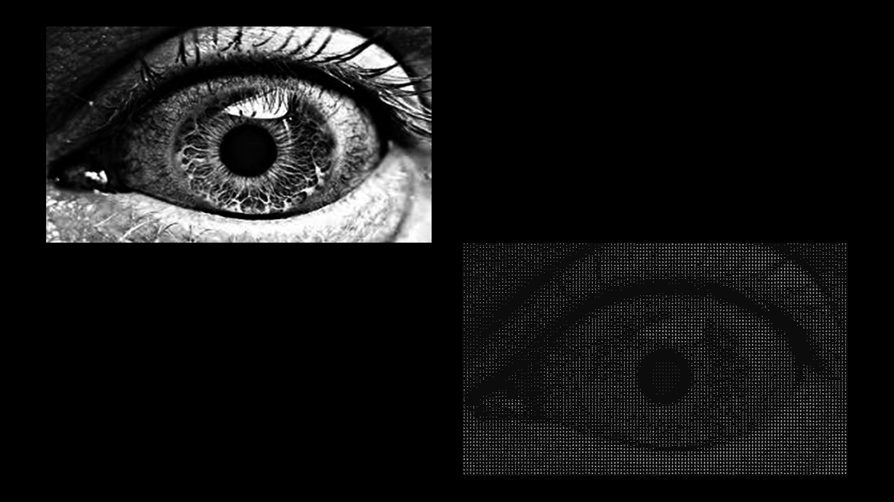

# Steganography-ASCII-Art
This repository was created to serve as a backup for my local project, Steganography ASCII Art.

---
### Usage -
<b>Encode:</b> img2ascii {Inverted(0/1)} {ImageFilePath(path/file.png)} {MESSAGE} 

        Example - img2ascii 0 "./sampleImageFile.png" "Hello, World!"
<b>Decode:</b> img2ascii {TextFilePath(path/file.txt)}
        
        Example - img2ascii "./outputTextFile.txt"

---
### Examples -
<i>These are just the examples of ASCII Art generated, for the Steganography aspect of this project feel free to clone the repository and try it out.</i>

